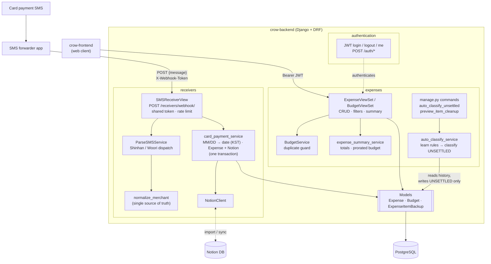

# crow-backend

Django REST Framework backend for tracking card payment expenses. Receives card payment SMS notifications via webhook, parses them, and syncs with Notion databases.

[](https://github.com/nonasking/crow-backend/actions/workflows/ci.yml)
[](https://codecov.io/gh/nonasking/crow-backend)
[](https://www.python.org/)
[](https://www.djangoproject.com/)

- **Production** — running on Render for 3+ months. Card payment SMS → real-time parsing → PostgreSQL → Notion sync, used daily.
- **Testing** — 202 tests across 17 modules. pytest-django integration tests with JWT-authenticated fixtures and external API mocking.
- **Merchant normalization** — SMS item strings (`(일시불)06/20 카페63도`) are normalized to clean merchant names, with a reversible data migration and original-value backups.
- **Auto-classification** — deterministic rules learned from manually-confirmed history fill in `UNSETTLED` expenses. Dry-run by default, and never learns from its own output.
- **API docs** — OpenAPI 3 schema auto-generated by drf-spectacular (Swagger UI / ReDoc).

---

## Architecture


```mermaid
flowchart TB
    SMS[Card payment SMS] --> FWD[SMS forwarder app]
    FE["crow-frontend<br/>(web client)"]

    subgraph backend["crow-backend (Django + DRF)"]
        direction TB

        subgraph rcv["receivers"]
            WH["SMSReceiverView<br/>POST /receivers/webhook/<br/>shared token · rate limit"]
            PARSE["ParseSMSService<br/>Shinhan / Woori dispatch"]
            NORM["normalize_merchant<br/>(single source of truth)"]
            REC["card_payment_service<br/>MM/DD → date (KST) · Expense + Notion<br/>(one transaction)"]
            NC["NotionClient"]
            WH --> PARSE --> NORM
            WH --> REC --> NC
        end

        subgraph auth["authentication"]
            JWT["JWT login / logout / me<br/>POST /auth/*"]
        end

        subgraph exp["expenses"]
            API["ExpenseViewSet / BudgetViewSet<br/>CRUD · filters · summary"]
            BSVC["BudgetService<br/>duplicate guard"]
            SUM["expense_summary_service<br/>totals · prorated budget"]
            ACSVC["auto_classify_service<br/>learn rules → classify UNSETTLED"]
            CMD["manage.py commands<br/>auto_classify_unsettled<br/>preview_item_cleanup"]
            API --> BSVC
            API --> SUM
            CMD --> ACSVC
        end

        MODELS[["Models<br/>Expense · Budget · ExpenseItemBackup"]]
    end

    FWD -- "POST {message}<br/>X-Webhook-Token" --> WH
    FE -- "Bearer JWT" --> API
    JWT -. authenticates .-> API

    REC --> MODELS
    NC <-. "import / sync" .-> NOTION[(Notion DB)]
    API --> MODELS
    ACSVC -- "reads history,<br/>writes UNSETTLED only" --> MODELS
    MODELS --> PG[(PostgreSQL)]
```

Three apps split by responsibility, plus one stub:

- `receivers` — webhook endpoint, SMS parsing (`ParseSMSService`), merchant normalization (`normalize_merchant`), payment recording (`card_payment_service`), and the Notion API client.
- `expenses` — Expense / Budget CRUD, summary aggregations, Notion import, and the auto-classification service behind its management command.
- `authentication` — JWT login / logout / current user; backs the auth fixture used in the rest of the test suite.
- `analytics` — scaffolded, not implemented. No models, views, or routes yet.

External clients hit DRF endpoints; the service layer owns parsing, aggregation, classification, and Notion sync. Single-field validation lives in serializers. ViewSets stay thin.

`normalize_merchant` lives in `receivers.services` and is reused verbatim by the expenses data migration and the auto-classifier — the parser and the classifier must agree on what a merchant name *is*, so there is exactly one implementation of it.

---

## Tech Stack

| Layer | Technology |
|---|---|
| Framework | Django 6 + Django REST Framework |
| Database | PostgreSQL (psycopg3) |
| Auth | JWT via `djangorestframework-simplejwt` |
| API Docs | drf-spectacular (Swagger / ReDoc) |
| Filtering | django-filter |
| Testing | pytest + pytest-django |
| Package Manager | Poetry |
| Deployment | Gunicorn + Render |

---

## Setup

### Prerequisites

- Python 3.13+
- PostgreSQL
- [Poetry](https://python-poetry.org/docs/#installation)

### 1. Install dependencies

```bash
poetry install
```

### 2. Configure environment

Create `.env.local` in the project root:

```env
SECRET_KEY=your-secret-key
DEBUG=True

DATABASE_NAME=crow
DATABASE_USER=postgres
DATABASE_PASSWORD=postgres
DATABASE_HOST=127.0.0.1
DATABASE_PORT=5432

NOTION_TOKEN=your-notion-integration-token
NOTION_EXPENSE_DATABASE_ID=your-expense-db-id
NOTION_BUDGET_DATABASE_ID=your-budget-db-id
NOTION_VERSION=2022-06-28

# Shared secret for the SMS webhook (see "SMS Receiver" below).
# Leave empty only for local development.
SMS_WEBHOOK_TOKEN=a-long-random-string
```

> The app reads `.env.{DJANGO_ENV}` where `DJANGO_ENV` defaults to `local`.
> For production, set `DJANGO_ENV=prod` and create `.env.prod` (any value other than `local`/`test` also turns on `sslmode=require` for PostgreSQL).

### 3. Apply migrations

```bash
poetry run python manage.py migrate
```

### 4. Create a superuser

```bash
poetry run python manage.py createsuperuser
```

### 5. Run the development server

```bash
poetry run python manage.py runserver
```

---

## API Reference

Interactive docs are available at `/api/docs/` (Swagger UI) and `/api/redoc/` (ReDoc) once the server is running.

### Authentication

All endpoints require `Authorization: Bearer <access_token>` unless noted otherwise.

Tokens are issued on login: access token lifetime is **24 hours**, refresh token is **7 days**. `POST /auth/refresh/` trades a refresh token for a new access token, so a login lasts as long as the refresh token (7 days); refresh tokens are not rotated. Logging out blacklists the refresh token (`rest_framework_simplejwt.token_blacklist`), so a leaked one stops working once its owner logs out; other devices' tokens keep working.

---

### Auth

| Method | Endpoint | Auth | Description |
|---|---|---|---|
| `POST` | `/auth/login/` | None | Obtain JWT token pair |
| `POST` | `/auth/refresh/` | None | Exchange a refresh token for a new access token |
| `POST` | `/auth/logout/` | None | Revoke the refresh token in the body (`{"refresh": ...}`) so it can no longer mint access tokens |
| `GET` | `/auth/me/` | Required | Get current user info |

**Login request:**
```json
{ "username": "admin", "password": "password123" }
```

**Login response:**
```json
{
  "access": "<access_token>",
  "refresh": "<refresh_token>",
  "user": { "id": 1, "username": "admin" }
}
```

---

### Expenses

| Method | Endpoint | Description |
|---|---|---|
| `GET` | `/expenses/expenses/` | List expenses (paginated, filterable) |
| `POST` | `/expenses/expenses/` | Create an expense |
| `GET` | `/expenses/expenses/{id}/` | Retrieve an expense |
| `PUT` | `/expenses/expenses/{id}/` | Replace an expense |
| `PATCH` | `/expenses/expenses/{id}/` | Partially update an expense |
| `DELETE` | `/expenses/expenses/{id}/` | Delete an expense |
| `GET` | `/expenses/expenses/options/` | List available categories, subcategories, and payment methods |
| `GET` | `/expenses/expenses/summary/` | Aggregated expense summary |
| `GET` | `/expenses/expenses/breakdown/` | Totals by category and by month over every expense matching the list filters (no pagination); backs the dashboard charts |
| `POST` | `/expenses/expenses/migrate-expenses-from-notion/` | Import expenses from Notion |

**Expense fields:** `spent_at`, `category`, `sub_category`, `item`, `payment_method`, `amount`, `memo`, `auto_classified` (read-only)

`auto_classified` is `true` when the row was categorized by the [auto-classifier](#auto-classification) rather than by hand. It's read-only over the API — only the management command sets or clears it.

**Filters:** `spent_at`, `category`, `sub_category`, `payment_method`

**Ordering:** `spent_at`, `amount`, `category`, `sub_category`, `payment_method`

---

### Budget

| Method | Endpoint | Description |
|---|---|---|
| `GET` | `/expenses/budget/` | List budgets (paginated, filterable) |
| `POST` | `/expenses/budget/` | Create a budget |
| `GET` | `/expenses/budget/{id}/` | Retrieve a budget |
| `PUT` | `/expenses/budget/{id}/` | Replace a budget |
| `PATCH` | `/expenses/budget/{id}/` | Partially update a budget |
| `DELETE` | `/expenses/budget/{id}/` | Delete a budget |
| `POST` | `/expenses/budget/migrate-budget-from-notion/` | Import budgets from Notion |

**Budget fields:** `year`, `month`, `category`, `sub_category`, `amount`, `memo`

---

### SMS Receiver

| Method | Endpoint | Auth | Description |
|---|---|---|---|
| `POST` | `/receivers/webhook/` | Shared token | Receive card payment SMS and sync to Notion |

The forwarder app can't do JWT, so the webhook checks a shared secret instead: send `SMS_WEBHOOK_TOKEN` in the `X-Webhook-Token` header, or as `?token=` if the forwarder can't set headers (the query string may end up in access logs, so prefer the header). A missing or wrong token gets `403`. If `SMS_WEBHOOK_TOKEN` is unset the check is skipped, and with `DEBUG=False` the system check `receivers.W001` warns at startup; that gap exists only so a deploy and the forwarder config change don't have to happen at the same instant. The endpoint is also rate-limited (`SMS_WEBHOOK_THROTTLE_RATE`, default `30/minute`) with one global bucket, since the forwarder is the only caller; the limit is checked before the token, so token guessing is limited too. The cache is per-process, so the effective limit is that rate times the number of gunicorn workers.

Supports **Shinhan** and **Woori** card SMS formats. The service parses the raw SMS text into structured data (`amount`, `item`, `payment_method`, `spent_at`) and saves it as an `UNSETTLED` expense and a Notion page in one transaction: the row is written first, and if Notion fails the row is rolled back and the webhook answers `503` so the forwarder can retry. A database error means Notion is never called. This is not idempotent, though: if Notion creates the page and then times out, a retry creates a second page.

Cancellation SMS (`승인취소`, or `취소` right after the card number) are not recorded; the webhook answers `200` with `{"status": "ignored"}` and logs the message. Recording them the old way counted a refund as a second expense. The original approval stays recorded, so a cancelled purchase still needs to be removed by hand.

The SMS only carries `MM/DD`, so the year is inferred: this year, unless that lands in the future, in which case last year. "Today" is taken in KST (`expenses.constants.LOCAL_TIMEZONE`), not the server's UTC, so payments made between 00:00 and 08:59 KST don't get pushed back a year.

**Request:**
```json
{ "message": "[Web발신]\n신한카드(1234)승인 2,400원 04/20 14:32 세븐일레븐" }
```

---

### System

| Method | Endpoint | Auth | Description |
|---|---|---|---|
| `GET` | `/health/` | None | Health check |
| `GET` | `/api/docs/` | None | Swagger UI |
| `GET` | `/api/redoc/` | None | ReDoc |
| `GET` | `/api/schema/` | None | OpenAPI schema (YAML) |

---

## Merchant Normalization

Card SMS puts the payment marker and date in front of the merchant name, so the raw item reads `(일시불)06/20 카페63도` rather than `카페63도`. `normalize_merchant` (in `receivers.services`) strips the `(일시불)` / `(할부N개월)` marker, the leading `MM/DD` date and optional `HH:MM` time, and corporate forms (`(주)`, `주식회사`, `㈜`). Input that doesn't match the SMS shape is returned untouched.

Migration `0005_normalize_sms_items` backfills existing rows. It only rewrites items that match the SMS format, saves every original to `ExpenseItemBackup` before touching it, and is idempotent — rows already backed up are skipped on re-run. `backwards` restores from those backups, so the migration is reversible.

Preview the impact before running it:

```bash
poetry run python manage.py preview_item_cleanup          # affected count + samples, no writes
poetry run python manage.py preview_item_cleanup --all    # print every affected row
```

---

## Auto-Classification

Expenses arriving from the webhook land as `UNSETTLED`. Rather than categorizing each one by hand, `auto_classify_service` learns deterministic rules from history and applies them.

A rule is adopted for a normalized merchant key only when all three hold:

1. Every past occurrence carries the **same** `(category, sub_category)` — an ambiguous merchant is skipped.
2. It appears at least `--min-count` times (default 2).
3. The key is at least 2 characters — one-character merchants are too ambiguous to trust.

The training set is **manually confirmed rows only** (`category != UNSETTLED AND auto_classified == False`). Rows the classifier itself wrote are excluded, so it can never learn from its own output. Only `UNSETTLED` rows are ever modified; classified rows are flagged `auto_classified=True`, which makes the whole operation reversible.

```bash
# Dry-run: report what would be classified, change nothing
poetry run python manage.py auto_classify_unsettled

# Require 3 confirmations before trusting a merchant
poetry run python manage.py auto_classify_unsettled --min-count 3

# Actually apply
poetry run python manage.py auto_classify_unsettled --apply

# Undo: reset every auto_classified row back to UNSETTLED (manual rows untouched)
poetry run python manage.py auto_classify_unsettled --revert
```

Unmatched `UNSETTLED` rows are reported in two buckets: **ambiguous** (the merchant has history, but it isn't deterministic enough to adopt) and **new** (never seen in confirmed history). The first tells you where the rules are too strict; the second is genuinely new spending.

---

## Testing

**202 tests across 17 modules**, run on a dedicated PostgreSQL test database.
(166 test functions; parametrized suites expand to 202 cases.)

| Module | Tests | What it covers |
|---|---|---|
| `receivers/tests/test_normalize_merchant.py` | 30 | Merchant normalization: `(일시불)` / `(할부N개월)` markers, date & time prefixes, corporate forms (`(주)`, `㈜`), idempotency, non-SMS passthrough |
| `expenses/tests/test_budget_viewset.py` | 20 | Budget CRUD, validation, duplicate guard, edge cases |
| `expenses/tests/test_auto_classify_service.py` | 21 | Rule learning (single-distribution / ambiguous / low-frequency / key-length boundaries), echo-chamber guard, dry-run vs apply, revert |
| `receivers/tests/test_parse_sms_service.py` | 25 | Shinhan & Woori SMS parsing, both formats, merchant names containing 잔/액, empty or overlong merchant, cancellation detection (and no false positive when a merchant name contains 취소) |
| `receivers/tests/test_card_payment_service.py` | 11 | `MM/DD` → date (year rollover, leap day, KST vs UTC), Notion and `Expense` get the same date, Notion failure saves nothing |
| `receivers/tests/test_sms_webhook_security.py` | 14 | Webhook shared token (header, query, missing, wrong), cancellation ignored, Notion failure → `503` + rollback, DB failure skips Notion, rate limit (spoofed `X-Forwarded-For` and token guessing included), startup warning when the token is unset |
| `authentication/tests/test_auth.py` | 7 | JWT login / logout (works without an access token) / token lifetime |
| `authentication/tests/test_refresh.py` | 13 | Access-token refresh: usable new access, no rotation, invalid/expired/access-as-refresh/missing token, stale `Authorization` header ignored, inactive or deleted user → `401`; logout revokes only the given refresh token, garbage or repeated logout is harmless |
| `expenses/tests/test_preview_item_cleanup_command.py` | 6 | `preview_item_cleanup` command — reports impact, mutates nothing |
| `expenses/tests/test_auto_classify_unsettled_command.py` | 5 | `auto_classify_unsettled` command — dry-run default, `--apply`, `--revert` |
| `expenses/tests/test_normalize_sms_items_migration.py` | 5 | Data migration 0005 — forwards, backwards restore from backup, idempotency |
| `expenses/tests/test_expense_viewset.py` | 12 | Expense CRUD, ordering (including `item` / `memo`, ties broken by `id`), read-only `auto_classified` (cleared when the category is edited by hand), Notion import, multi-month summary, summary filtered by subcategory |
| `receivers/tests/test_notion_migration.py` | 9 | Notion → DB import: duplicate skipping (budget duplicates inside Notion created once; identical same-day expenses all kept), batched `bulk_create`, budget re-run via the API, `409` + full rollback on a budget conflict (other constraint errors are not disguised as `409`) |
| `receivers/tests/test_sms_receiver_webhook.py` | 3 | SMS webhook → `Expense` flow with mocked Notion, unsupported card error |
| `expenses/tests/test_expense_summary.py` | 11 | Summary defaults (year/month, daily budget) follow the KST date; daily budget for past/current/future months; `month` outside 1–12 and `year` outside 2000–2100 rejected |
| `expenses/tests/test_expense_breakdown.py` | 9 | Chart breakdown: aggregates past one page, same filters as the list, pagination/ordering params ignored, negative amounts netted, month/year boundaries, three queries regardless of row count |
| `config/test_health.py` | 1 | `/health/` endpoint |

The safety-critical paths get the most attention: anything that **writes** (the data migration, `--apply`, `--revert`) is tested for what it must *not* touch, not just what it changes.

External dependencies (Notion API) are isolated via `unittest.mock.patch`. Shared fixtures live in `conftest.py`:

- `user` — creates a test `User`
- `auth_client` — JWT-authenticated `APIClient`

```bash
# Run all tests
poetry run pytest

# With coverage
poetry run pytest --cov=.

# Specific app
poetry run pytest expenses/

# Re-run only failures
poetry run pytest --lf
```

---

## Project Structure

```
crow-backend/
├── config/               # Django settings, root URLs, health check, WSGI/ASGI
├── authentication/       # Login, logout, current user endpoints
├── expenses/
│   ├── models/           # Expense, Budget, ExpenseItemBackup
│   ├── views/            # ExpenseViewSet, BudgetViewSet
│   ├── serializers/      # API and model serializers
│   ├── services/         # BudgetService, expense_summary_service, auto_classify_service
│   ├── management/       # auto_classify_unsettled, preview_item_cleanup
│   └── migrations/       # incl. 0005 SMS item normalization (reversible)
├── receivers/
│   ├── views/            # SMS webhook endpoint
│   ├── services/         # ParseSMSService, normalize_merchant, card_payment_service
│   └── externals/notion/ # Notion API client
├── analytics/            # Scaffolded only — no models, views, or routes yet
├── conftest.py           # Shared pytest fixtures
└── pyproject.toml        # Dependencies and tooling config
```
